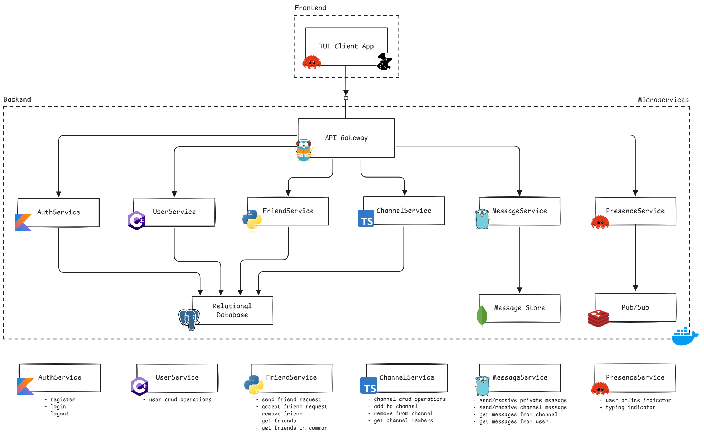

<pre style="overflow-wrap: break-word; white-space: pre-wrap; text-align: center;">
███████╗██╗  ██╗ ██████╗ ██╗   ██╗████████╗
██╔════╝██║  ██║██╔═══██╗██║   ██║╚══██╔══╝
███████╗███████║██║   ██║██║   ██║   ██║   
╚════██║██╔══██║██║   ██║██║   ██║   ██║   
███████║██║  ██║╚██████╔╝╚██████╔╝   ██║   
╚══════╝╚═╝  ╚═╝ ╚═════╝  ╚═════╝    ╚═╝   
</pre>

**TUI Real-time Messaging App**

---

## 🖧 Architecture
- **Frontend**
  - TUI application built with **Rust** and **ratatui** for a seamless interactive user experience

- **Backend**
  - **Microservices**:
    - **AuthService** (Kotlin): User authentication & authorization
    - **UserService** (C#): Handles user profile information
    - **FriendService** (Python): Deals with friend requests
    - **ChannelService** (TypeScript): Manages channels
    - **MessageService** (Go): Provides WebSocket-based messaging for channels and DMs
    - **PresenceService** (Rust): Tracks user presence and typing indicators using pub/sub
  - **Storage**:
    - **PostgreSQL**: Stores relationships and metadata (users, friendships, servers, ...)    
    - **MongoDB**: For storing messages 
  - **Communication**:
    - **REST** and **WebSockets** for client API
    - **gRPC** for communication between microservices
  - **API Gateway**:
    - **Traefik** for routing requests across services
  - **Deployment**:
    - Fully containerized with **Docker**

 

